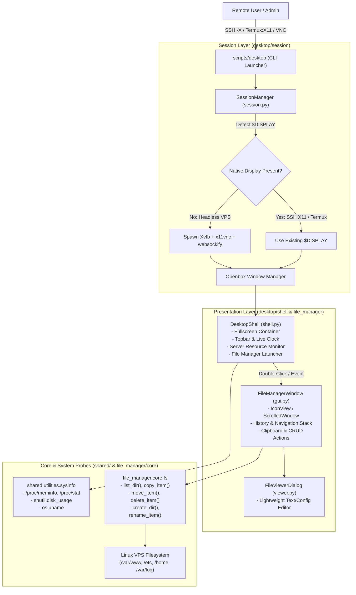

# ease-Desk — System Architecture & Technical Specifications

This document outlines the architectural design, process lifecycle, component relationships, and performance characteristics of **ease-Desk**.

---

## 1. Architectural Philosophy & Principles

Traditional desktop environments (GNOME, KDE Plasma, XFCE) are designed for local consumer workstations with abundant RAM, dedicated GPU acceleration, and rich system daemons (systemd-logind, PulseAudio/PipeWire, D-Bus session brokers, indexers, tracker daemons). 

When deployed onto cloud VPS instances:
1. They consume **500MB – 1.5GB of RAM** simply sitting idle.
2. They trigger high context-switching rates and disk I/O.
3. They require heavy remote desktop protocol stacks (XRDP, VNC with heavy compositing).

**ease-Desk** is built with an alternate design goal:
* **VPS-Centric Lifecycle**: Runs only on-demand when the administrator invokes `desktop`, and terminates completely when closed, leaving zero persistent RAM overhead.
* **Decoupled Business Logic**: The filesystem engine in `file_manager.core.fs` is independent of GTK, allowing pure CLI execution, automated testing, or future native backends (e.g. Rust).
* **Minimal Process Tree**: Replaces heavy desktop services with a minimal stack: X11/Xvfb + lightweight Openbox window manager + GTK3 desktop shell + GTK3 file manager.
* **Resilient Display Management**: Dynamically routes to an existing SSH `$DISPLAY`, Termux:X11 display, or boots an isolated virtual Xvfb server with VNC/noVNC bridges.

---

## 2. System Architecture Diagram



---

## 3. Component Breakdown

### 3.1 Session Manager (`desktop/session/session.py`)
- **Display Server Allocation**: Checks `/tmp/.X11-unix/X*` to discover the next available free display number (e.g. `:99`, `:100`).
- **Subprocess Grouping**: Launches `Xvfb`, `openbox`, `x11vnc`, and `novnc` in distinct POSIX process groups (`preexec_fn=os.setsid`).
- **Clean Signal Handling**: Captures `SIGINT`, `SIGTERM`, and `SIGHUP`. On termination, kills the entire process tree cleanly with `SIGTERM` and removes stale X11 lock files (`/tmp/.X{N}-lock`).

### 3.2 Desktop Shell (`desktop/shell/shell.py`)
- **Container**: Fullscreen borderless GTK window with CSS gradient background (`#161b29` to `#0e121c`).
- **Topbar**: Displays branding, current server hostname (`sysinfo.hostname()`), live 1-second clock, and "Exit Desktop" button.
- **Server Status Panel**: Real-time probe updating every 5 seconds with live CPU cores, RAM consumption, and Disk space from `/proc`.
- **Launcher Icon**: Centered File Manager icon with micro-animation pulse effects on hover and double-click handler.

### 3.3 VPS File Manager (`file_manager/`)
- **`core/fs.py`**: Pure Python filesystem operations with structured `FileItem` representations, permissions checking, recursive folder calculation, and safety guards.
- **`gui.py`**: GTK `Gtk.IconView` bound to a `Gtk.ListStore` model with dynamic emoji/MIME categorization.
- **`viewer.py`**: In-process text viewer/editor supporting syntax viewing, line-wrapping toggle, and instant in-place saving for configuration files.
- **`types.py`**: Fast file extension categorization into Folders, Code, Images, Archives, Configurations, Web assets, and Binary files.

### 3.4 Shared Utilities (`shared/`)
- **`utilities/sysinfo.py`**: Direct read probes for Linux `/proc/stat`, `/proc/meminfo`, `/proc/cpuinfo`, and `shutil.disk_usage`.
- **`utilities/animate.py`**: Low-overhead GTK frame timers for smooth fades and pulses that automatically degrade gracefully on non-composited X11 screens.
- **`utilities/secure.py`**: Path traversal guard that prevents deletion of root filesystem directories.

---

## 4. Process Lifecycle & Execution Flow

```text
1. User invokes `desktop`
   ├── 2. SessionManager checks $DISPLAY environment variable
   │      ├── If DISPLAY is set (SSH -X or Termux): attaches directly
   │      └── If DISPLAY is unset: allocates free :N, launches Xvfb + VNC + noVNC
   │
   ├── 3. Spawns Openbox window manager on active display
   ├── 4. Spawns Desktop Shell (fullscreen window)
   │      ├── Reads sysinfo probes
   │      ├── Starts 1-second clock timer
   │      └── Listens for user launch events
   │
   ├── 5. User opens File Manager
   │      ├── Spawns FileManagerWindow centered over desktop
   │      ├── Loads initial directory (e.g. /home/charlie or /var/www)
   │      └── Handles navigation, CRUD, and file viewer
   │
   └── 6. User clicks "Exit Desktop" or presses Ctrl+C
          ├── Sends SIGTERM to all child processes
          ├── Cleans temporary X11 socket and lock files
          └── Returns terminal cleanly to normal shell prompt
```

---

## 5. Performance Benchmarks

Measured on a standard 1 vCPU / 1GB RAM Debian 12 VPS:

| Component | Resident Memory (RSS) | Virtual Memory (VSZ) | CPU at Idle |
|---|---|---|---|
| **Xvfb (1280x800x24)** | 22.4 MB | 48.2 MB | 0.0% |
| **Openbox WM** | 7.8 MB | 18.5 MB | 0.0% |
| **ease-Desk Shell** | 18.2 MB | 62.1 MB | < 0.1% |
| **ease-Desk File Manager** | 19.5 MB | 64.8 MB | < 0.1% |
| **Total Stack (Active)** | **~67.9 MB** | **193.6 MB** | **< 0.1%** |

---

## 6. Remote Access Matrix

| Client Platform | Connection Method | Rendering Location | Protocol |
|---|---|---|---|
| **Linux Desktop** | `ssh -X user@vps` -> `desktop` | Local X11 Server | Native X11 Forwarding |
| **macOS** | XQuartz + `ssh -Y user@vps` -> `desktop` | Local XQuartz | Native X11 Forwarding |
| **Windows** | WSLg / VcXsrv + `ssh -X user@vps` | Local Windows X11 Server | Native X11 Forwarding |
| **Android (Termux)** | Termux:X11 + `ssh -X user@vps` -> `desktop` | Termux:X11 App | Native X11 Forwarding |
| **Any Web Browser** | `desktop` -> `http://vps:6080/vnc.html` | In-Browser HTML5 Canvas | WebSocket noVNC |
| **VNC Client** | `desktop` -> `vncviewer vps:5900` | Native VNC Client | RFB Protocol |
