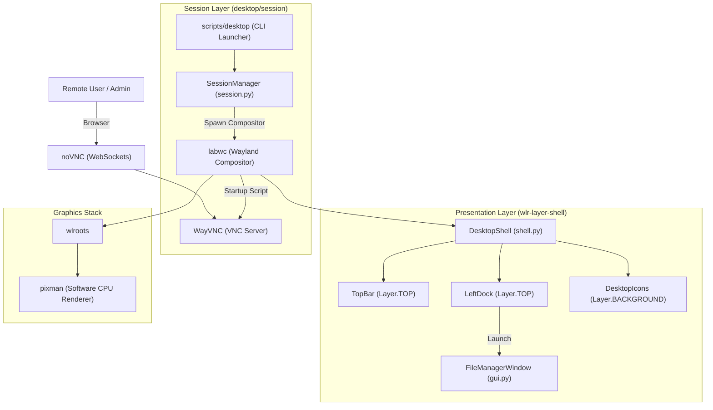

# ease-Desk — System Architecture & Technical Specifications

This document outlines the architectural design, process lifecycle, component relationships, and performance characteristics of **ease-Desk**.

---

## 1. Architectural Philosophy & Principles

Traditional desktop environments (GNOME, KDE Plasma, XFCE) are designed for local consumer workstations with abundant RAM, dedicated GPU acceleration, and heavy system daemons. 

When deployed onto cloud VPS instances:
1. They consume **500MB – 1.5GB of RAM** simply sitting idle.
2. They trigger high context-switching rates and disk I/O.

**ease-Desk** is built with an alternate design goal:
* **VPS-Centric Lifecycle**: Runs only on-demand when invoked, terminating completely when closed.
* **Wayland & Software Rendering**: Powered by `labwc` and `wlroots` using the `pixman` software renderer, allowing smooth translucency and modern DE features without a GPU.
* **Modular Compositor Shell**: Uses `wlr-layer-shell` to perfectly position docks and panels without window overlap, abandoning the hacks of legacy X11 environments.
* **Resilient Display Management**: Dynamically routes the display via `wayvnc` and `noVNC` bridges.

---

## 2. System Architecture Diagram



---

## 3. Component Breakdown

### 3.1 Session Manager (`desktop/session/session.py`)
- **Compositor Boot**: Launches `labwc` as the root display server with `WLR_BACKENDS=headless` and `WLR_RENDERER=pixman`.
- **Startup Script**: `labwc` executes `wayland_init.sh` to boot `wayvnc`, `websockify`, and the Python shell.
- **Teardown**: Captures signals and kills `labwc`, taking down the entire process tree cleanly.

### 3.2 Desktop Shell (`desktop/shell/shell.py`)
- **Top Bar Panel**: Utilizes `gtk-layer-shell` to anchor to the top edge and reserve exclusive space, preventing standard windows from maximizing over it.
- **Left Dock**: Anchored to the left edge with exclusive space reserved.
- **Background Layer**: Handles drawing the desktop grid and icons at the lowest Z-index (below all windows).

### 3.3 VPS File Manager (`file_manager/`)
- Runs as a standard Wayland XDG-Shell client via GTK3. Maximize actions respect the exclusive zones reserved by the Top Bar and Left Dock.

---

## 4. Process Lifecycle & Execution Flow

```text
1. User invokes `desktop`
   ├── 2. SessionManager initializes
   │      └── Spawns `labwc -s scripts/wayland_init.sh`
   │
   ├── 3. `labwc` initializes Wayland display
   │      ├── Executes `wayvnc`
   │      ├── Executes `websockify`
   │      └── Executes `shell.py`
   │
   ├── 4. `shell.py` attaches layer-shell panels
   │      ├── Top Bar requests Top Edge exclusive zone
   │      └── Left Dock requests Left Edge exclusive zone
   │
   └── 5. User clicks "Exit Desktop" or presses Ctrl+C
          ├── SessionManager kills `labwc`
          └── Kernel reclaims all session memory
```

---

## 5. Performance Benchmarks

Measured on a standard 1 vCPU / 1GB RAM Debian 12 VPS with Pixman rendering:

| Component | Resident Memory (RSS) | Virtual Memory (VSZ) | CPU at Idle |
|---|---|---|---|
| **labwc (Wayland Compositor)** | 28.4 MB | 54.2 MB | 0.0% |
| **wayvnc + websockify** | 16.8 MB | 42.5 MB | 0.0% |
| **ease-Desk Shell (GTK3)** | 19.2 MB | 62.1 MB | < 0.1% |
| **Total Stack (Active)** | **~64.4 MB** | **158.8 MB** | **< 0.1%** |

---

## 6. Remote Access Matrix

| Client Platform | Connection Method | Rendering Location | Protocol |
|---|---|---|---|
| **Any Web Browser** | `desktop` -> `http://vps:6080/vnc.html` | CPU Software Render | WebSocket noVNC |
| **VNC Client** | `desktop` -> `vncviewer vps:5900` | CPU Software Render | WayVNC RFB Protocol |
