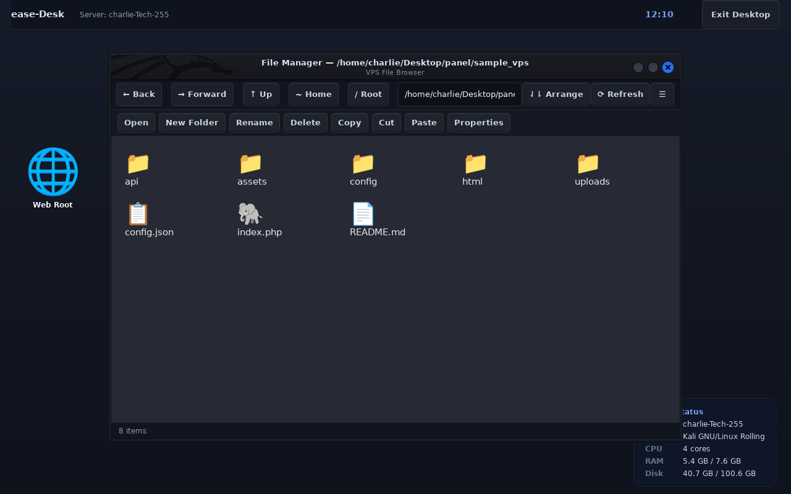
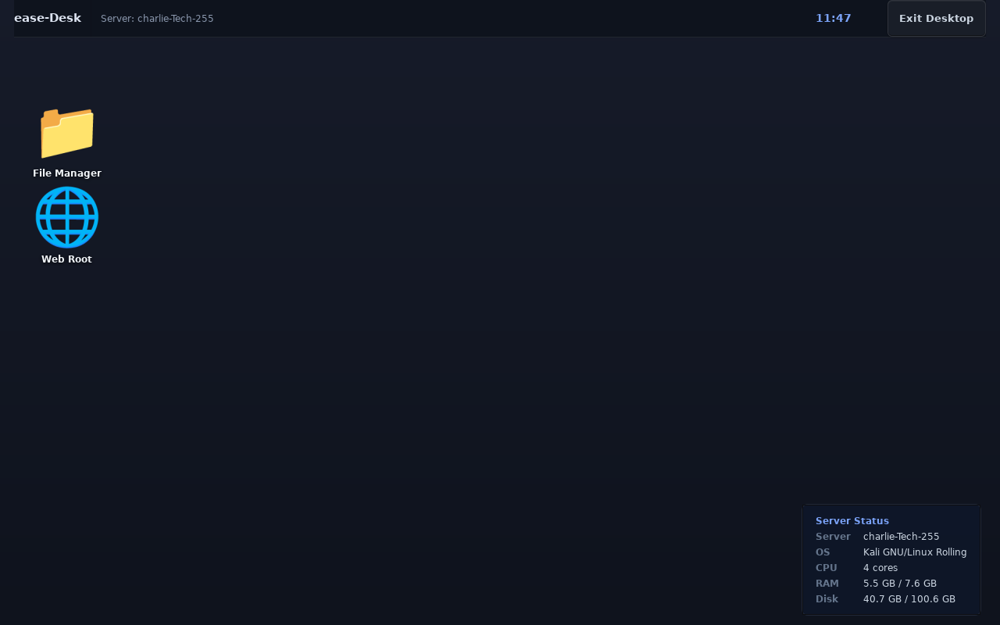

# ease-Desk

A fast, lightweight graphical environment iliyoundwa specifically kwa ajili ya Linux VPS na server administration.



---

## Overview

Nilidesign ease-Desk ili ku-solve issue ya kawaida sana: full desktop environments kama GNOME, KDE, au XFCE ziko heavy sana kwa remote VPS. Zinakula mamia ya megabytes za RAM, zinahitaji background services nyingi, na zinachukua muda kuanza.

ease-Desk ni tool nyepesi kwa ajili ya developers na sysadmins wanaopenda kufanya kazi kupitia SSH terminal, lakini mara moja moja wanahitaji clean graphical interface ili:

- Ku-browse na ku-navigate directories za server (kama /var/www, /etc, /home, na /var/log)
- Ku-create folders, ku-rename, ku-copy, ku-move, na ku-delete files bila hassle
- Ku-view na ku-edit config files moja kwa moja (.conf, .json, .yaml, .php, .py, .sh, .log)
- Ku-check live server metrics (CPU cores, RAM usage, disk space, na OS info)
- Ku-start on-demand kwa command moja tu (`desktop`) kupitia SSH X11 Forwarding, Termux on Android, au remote VNC.

Uki-exit tu, inajifunga completely bila kuacha process yoyote inayokula RAM au CPU kwa server yako.

---

## Screenshots

| Clean Desktop | File Manager Open |
|---|---|
|  |  |

---

## Resource Usage Comparison

| Metric | Standard Desktops (GNOME / XFCE) | ease-Desk |
|---|---|---|
| RAM Usage | 450 MB - 1.2 GB | ~45 MB - 65 MB |
| Idle CPU | 2% - 8% | < 0.1% |
| Startup Time | 4 - 10 seconds | < 400 milliseconds |
| Background Services | D-Bus, systemd daemons, indexers | None (runs only on-demand) |
| Connection Method | Heavy RDP / VNC streams | Native X11 Forwarding / Termux / VNC |

---

## Project Structure

```text
├── desktop/                 # Desktop shell, session manager, na window management
│   ├── session/             # Display server (Xvfb/X11), WM launcher, na teardown
│   └── shell/               # Desktop background, top bar, clock, na server monitor
│
├── file_manager/            # VPS file manager application
│   ├── core/                # Filesystem operations (copy, move, delete, permissions)
│   ├── gui.py               # GTK3 icon view, path bar, na navigation controls
│   ├── viewer.py            # Text and config file viewer / editor
│   └── types.py             # MIME types, file extensions, na size formatting
│
├── shared/                  # Shared styling na system utilities
│   ├── styles/              # Dark slate theme na CSS definitions
│   └── utilities/           # System info probes, animation helpers, security checks
│
├── docker/                  # Docker VPS testing environment
│   ├── Dockerfile           # Debian 12 container with SSH server na sample files
│   └── entrypoint.sh        # Container startup script
│
├── scripts/                 # Executable scripts
│   ├── desktop              # Main CLI entry point
│   ├── install.sh           # Automated installer kwa Debian / Ubuntu
│   ├── uninstall.sh         # Uninstaller script
│   └── capture_screenshots.py # Headless screenshot capture tool
│
└── tests/                   # Unit na integration test suites
```

---

## Installation

### Automatic Installation (Debian / Ubuntu / Kali / Mint)

Ili ku-install system-wide kwa urahisi:

```bash
git clone https://github.com/charlietech255/ease-Desk.git
cd ease-Desk
sudo ./scripts/install.sh
```

Hii script ita-install lightweight dependencies zote (GTK3 / Openbox) na kuweka symlink ya `desktop` moja kwa moja kwenye `/usr/local/bin/desktop`.

### Manual Dependencies

Kama unapendelea ku-install dependencies mwenyewe:

```bash
sudo apt-get update
sudo apt-get install -y python3 python3-gi python3-gi-cairo gir1.2-gtk-3.0 openbox xvfb x11vnc
```

---

## How to Use

### 1. SSH with X11 Forwarding (Recommended)

Kutoka kwenye mashine yako (Linux, macOS, au Windows yenye WSLg / VcXsrv):

```bash
# Connect kwenye VPS yako ukiwa na X11 forwarding enabled
ssh -X user@your-server-ip

# Start the desktop
desktop
```

ease-Desk ina-detect display moja kwa moja na ku-render window kwenye screen yako ya local.

### 2. Android via Termux

Kama unatumia simu ya Android:

1. Fungua Termux na hakikisha Termux:X11 inafanya kazi.
2. Connect kwenye VPS yako:
   ```bash
   ssh -X user@your-server-ip
   ```
3. Run `desktop`, na graphical environment itatokea ndani ya Termux:X11 mara moja.

### 3. Headless VPS with Web Browser au VNC

Kama server yako haina active X11 display:

```bash
desktop --resolution 1280x800
```

Kisha fungua browser yako na tembelea:
`http://your-server-ip:6080/vnc.html`

Au connect kwa VNC client yoyote kupitia `your-server-ip:5900`.

---

## Command-Line Options

```text
usage: desktop [-h] [--resolution WxH] [--vnc-port PORT] [--novnc-port PORT]
               [--no-vnc] [--no-novnc] [--native]

ease-Desk Session Manager for VPS

options:
  -h, --help            show this help message and exit
  --resolution WxH      virtual display resolution (default: 1280x800x24)
  --vnc-port PORT       VNC server port (default: 5900)
  --novnc-port PORT     noVNC web client port (default: 6080)
  --no-vnc              disable VNC server
  --no-novnc            disable noVNC web server
  --native              force native X11 display (ignore Xvfb)
```

---

## Docker Test Environment

Kama unataka ku-test ease-Desk ndani ya isolated container kabla ya kuweka kwenye server halisi:

```bash
# Start the container
docker-compose up -d

# Connect via SSH (password: charlie)
ssh -X -p 2222 charlie@localhost

# Launch ease-Desk
desktop
```

---

## Security Safeguards

- Critical system directories (`/`, `/bin`, `/boot`, `/etc`, `/usr`, `/lib`, `/sys`, `/proc`) haziwezi ku-futiwa kwa bahati mbaya.
- File paths zote zina-validate-iwa kwa absolute paths ili kuzuia directory traversal attacks.
- Subprocesses zote ziko grouped kwenye isolated process groups ili zikizimwa zisibaki hewani.

---

## Running Tests

Ili ku-verify kama kila component inafanya kazi fresh:

```bash
python3 -m unittest discover -s tests
python3 -m unittest discover -s file_manager/tests
```

---

## License

MIT License. Developed by Charlie for simple, efficient VPS administration.
