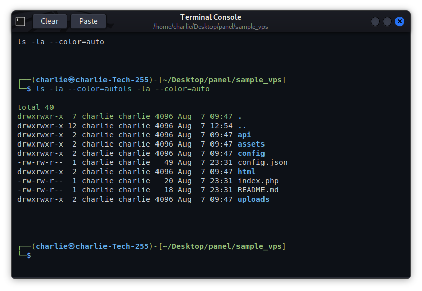

<div align="center">
  <h1>ease-Desk</h1>
  <p><strong>The modern, lightweight cloud desktop running straight from your browser.</strong></p>
</div>

<br>

> Karibu! Imagine having your entire Linux desktop accessible from any web browser in the world, running smoothly without requiring a heavy server. That is exactly what ease-Desk offers. Built for speed and simplicity, it transforms any standard VPS into a fully functional workspace.

---

## 1. Project Overview

### What is ease-Desk?
ease-Desk is a custom-built, highly optimized Linux desktop environment designed to run seamlessly in the cloud. Instead of relying on traditional, heavy desktop protocols, ease-Desk streams a full graphical interface directly to your web browser or native RDP client. It comes pre-packaged with a modern glassmorphism UI, a built-in file manager, a media player, and terminal tools.

### Why ease-Desk?
Most traditional remote desktops (like GNOME or KDE over VNC) are extremely heavy. They consume massive amounts of RAM and CPU, making them impossible to run on a basic $5 VPS. ease-Desk changes the rules. It uses an ultra-lightweight Openbox foundation combined with custom Python (GTK3) and Rust components to give you a premium experience on minimal hardware.

### What problem does it solve?
- **High Resource Usage**: Runs comfortably on a server with just 1GB of RAM.
- **Complex Setups**: Eliminates the headache of configuring VNC, SSL, and WebSockets manually. Our installer does it all.
- **Accessibility**: No need to install third-party clients. Access your desktop from Chrome, Safari, or Edge on any device.

### Screenshots

*The ease-Desk File Manager and System Monitor*


*The ease-Desk Terminal*


---

## 2. Installation

### System Requirements
- **OS**: Ubuntu 20.04/22.04/24.04, Debian 11/12 (Recommended)
- **RAM**: Minimum 1GB (2GB recommended for heavy browsing)
- **CPU**: 1 Core minimum
- **Network**: A server with a public IP address

### Step-by-Step Installation (Native)
The native installation configures your server directly, setting up Nginx, security protocols (Fail2Ban), and the desktop environment.

1. Connect to your server via SSH.
2. Clone the repository and enter the directory:
   ```bash
   git clone https://github.com/charlietech255/ease-Desk.git
   cd ease-Desk
   ```
3. Run the master installer:
   ```bash
   sudo ./scripts/install.sh
   ```
4. Follow the on-screen prompts. The system will provide you with a secure URL (e.g., `https://your-server-ip:8444`) to access your desktop.

### Step-by-Step Installation (Docker)
If you prefer not to modify your host system, you can run ease-Desk inside an isolated Docker container.

1. Ensure Docker and Docker Compose are installed on your server.
2. Clone the repository:
   ```bash
   git clone https://github.com/charlietech255/ease-Desk.git
   cd ease-Desk
   ```
3. Start the container in detached mode:
   ```bash
   docker-compose up -d --build
   ```
4. Access your desktop via your browser at `https://your-server-ip:8444`.

### RDP Connection Step-by-Step
If you prefer using Windows Remote Desktop Connection instead of the web browser, port `3389` is open and secured.

1. Open the **Remote Desktop Connection** app on your Windows machine.
2. In the "Computer" field, enter your server's IP address.
3. Click "Connect".
4. You will be prompted with an XRDP login screen. Enter your server username (e.g., `root` or `easedesk`) and your password.
5. You are now connected directly to the ease-Desk environment.

---

## 3. Troubleshoot

Even the best systems encounter issues. Here is how to resolve common problems.

### Error: "Cannot connect to server" (Browser)
- **Cause**: The Nginx service is down or the firewall is blocking port 8444.
- **Solution**: Check if Nginx is running using `sudo systemctl status nginx`. Ensure port 8444 is open by running `sudo ufw allow 8444`.

### Error: Black Screen on RDP Login
- **Cause**: Another session is already occupying the display, or the Openbox window manager failed to start.
- **Solution**: Restart the XRDP service by running `sudo systemctl restart xrdp`. If the issue persists, reboot the server.

### Error: "SSL Verification Error" during Installation
- **Cause**: Your server is missing core CA certificates.
- **Solution**: Run `sudo apt-get install ca-certificates` and re-run the `install.sh` script.

---

## 4. Keep Updated & Uninstall

### How to Update the Desktop
The ease-Desk project is constantly improving. To get the latest features and security patches, simply pull the latest code and run the installer again. It will safely update your system without deleting your personal files.

```bash
cd /opt/ease-desk
git pull
sudo ./scripts/install.sh
```

### How to Uninstall
If you need to remove ease-Desk completely and restore your server to its original state, we provide a clean uninstall script.

```bash
sudo ./scripts/uninstall.sh
```

---

## 5. Developer Contact

Feel free to reach out for business inquiries, custom features, or general feedback.

<a href="mailto:charliesyllas@gmail.com"></a>
<a href="https://wa.me/255740528822"></a>
<a href="https://www.tiktok.com/@dev_charlie"></a>
<a href="https://www.facebook.com/charliesyllas"></a>
<a href="https://charlietech.site"></a>

---

## 6. Call for Contribution & Support

### Contribute
We welcome all minds to make ease-Desk better! Whether you are a Python developer, a UI designer, or a documentation expert, your help is appreciated. Please read our [CONTRIBUTING.md](CONTRIBUTING.md) to understand the project architecture and how to submit a Pull Request.

### Support
If ease-Desk has saved you time or money, consider supporting the development. Your support helps keep the servers running and the coffee flowing.

<a href="https://www.buymeacoffee.com/devcharlie"></a>
